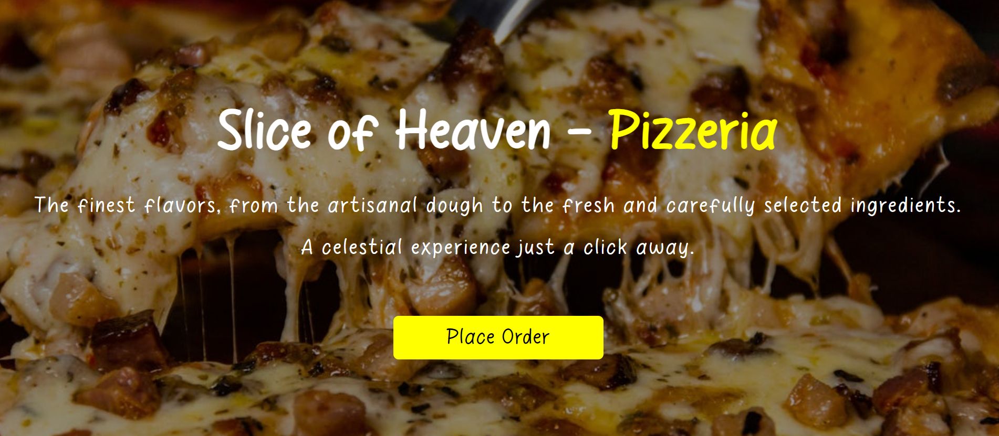

<h1 align="center"> Simple Pizzeria Project 🍕</h1> 

 This project was created during a RocketSeat event.

 

  
  <a href="#-live-demo">Live Demo</a>&nbsp;&nbsp;&nbsp;|&nbsp;&nbsp;&nbsp;
  <a href="#-screenshots">Screenshots</a>&nbsp;&nbsp;&nbsp;|&nbsp;&nbsp;&nbsp;
  <a href="#-technologies">Technologies</a>&nbsp;&nbsp;&nbsp;|&nbsp;&nbsp;&nbsp;
  <a href="#-features">Features</a>&nbsp;&nbsp;&nbsp;|&nbsp;&nbsp;&nbsp;
  <a href="#-project">Project</a>&nbsp;&nbsp;&nbsp;|&nbsp;&nbsp;&nbsp;
   <a href="#-license">License</a>&nbsp;&nbsp;&nbsp;|&nbsp;&nbsp;&nbsp;
  <a href="#-contributing">Contributing</a>&nbsp;&nbsp;&nbsp;|&nbsp;&nbsp;&nbsp;
  <a href="#support">Support</a>  

  

 

## 🌐 Live Demo

  

  Tip: Use right-click → “Open in new tab”.

 

## 📸 Screenshots

  

 

## 🛠 Technologies

* HTML 5
* CSS 3
* JavaScript
* Git e GitHub

 

## ✨ Features

- Attractive pizza menu section with clear item descriptions and visual highlights.
- Responsive HTML & CSS layout optimized for both desktop and mobile devices.

 

## 💻 Project

- A simple pizzeria website built with HTML and CSS.
  
 

## 📜 License

* This project is licensed under the [MIT License](https://choosealicense.com/licenses/mit/)

 

## 🫱🏻‍🫲🏻 Contributing

 Contributions, issues, and feature requests are welcome! Please, feel free to do it! 😉 

 

## 🌟 Support

 If you like this project, please give it a star ⭐ and share it with others! 😄 

